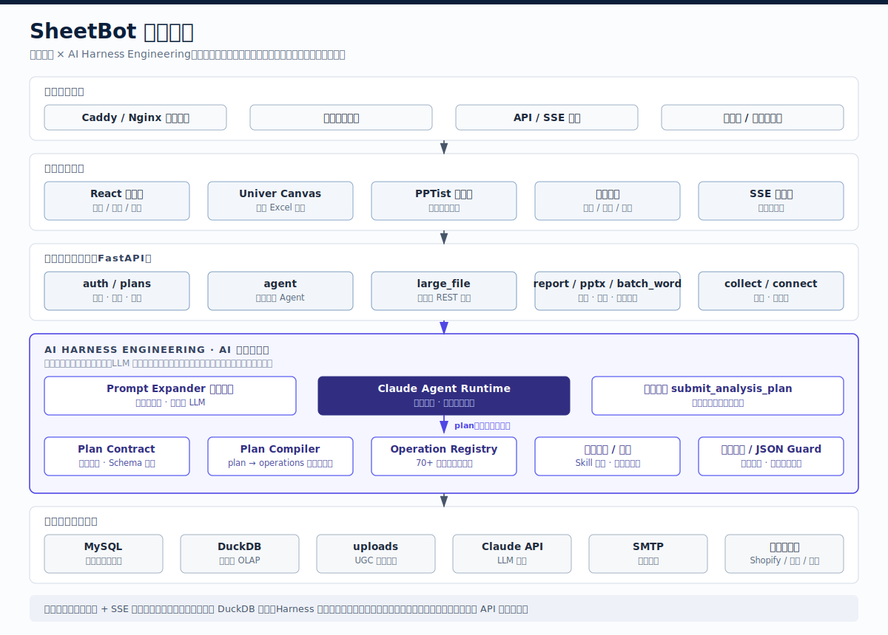

# SheetBot

[](https://www.python.org/downloads/)
[](https://fastapi.tiangolo.com/)
[](https://react.dev/)
[](https://www.mysql.com/)
[](LICENSE)

---

## 项目简介

SheetBot 是一款面向企业数据场景的 **AI Excel 与数据工作台**。它以 Excel 为入口，把自然语言操控、百万行大文件分析、智能报表、PPT 汇报、批量 Word、在线表单、外部系统连接与技能自动化整合到一个统一工作台中，帮助团队把分散在表格、系统与文档里的数据转化为可执行、可复盘、可交付的业务流程。

本项目由 **深圳市比特意图科技有限公司（BitIntent）** 开源维护。比特意图聚焦企业级 AI Native 产品研发与落地，旗下产品包括 SheetBot、GeoOps 与 AtlasBot。

- 公司官网：[https://www.eeebit.com/index.html](https://www.eeebit.com/index.html)
- SheetBot 官网：[https://sheetbot.eeebit.com/](https://sheetbot.eeebit.com/)

适合以下场景：

- 企业内部私有化部署 AI 表格与数据工作台
- 将 AI 分析、报表、汇报能力集成到现有 ERP / CRM / OA / HR 系统
- 面向财务、销售、运营、HR、教育、医疗等团队搭建自动化数据交付流程
- 开发者基于 FastAPI + React + Univer + PPTist  二次开发企业级办公应用

### 主要功能

- **AI 自然语言编辑**：用中文描述目标即可完成公式、筛选、排序、条件高亮、透视汇总、图表、格式美化等 70+ 表格操作，支持多轮上下文理解与实时 SSE 执行反馈。
- **双模式 Excel 引擎**：小文件在浏览器内用 Univer Canvas 流畅编辑；大文件自动进入服务端 DuckDB 模式，突破浏览器内存限制，适合 50MB+、百万行级 Excel 分析。
- **智能报表**：自动提取关键指标、趋势、异常与排名，生成图表、KPI 卡片、专家解读和优化建议，支持 PDF / PNG 导出与分享。
- **AI 汇报 PPT**：从表格数据中自动规划汇报结构，生成可编辑 PPT 页面，支持模板主题、图表注入、在线编辑与 PPTX 导出。
- **批量转 Word**：上传 Word 模板后识别占位符，将 Excel 每一行批量生成一份文档，支持日期、文本、图片替换与 ZIP 打包下载。
- **在线数据收集**：根据工作表字段生成在线表单，发布链接后外部用户填写，数据自动回流表格，适用于报名、调研、信息采集、业务上报。
- **外部系统连接**：支持 Shopify、钉钉、企业微信、MySQL、PostgreSQL、Webhook、自定义 API 等数据源，配置字段映射后自动同步到工作台。
- **Skill 技能编排**：提供 60+ 预置数据处理技能，支持拖拽组合成流水线，在沙箱中预览结果后写回工作簿，沉淀团队可复用的数据操作 SOP。

---

## 系统架构

SheetBot 采用「访问部署层、前端工作台层、后端业务层、AI 与执行引擎层、数据与外部系统层」的分层架构。普通 Excel 模式与大文件模式在后端模块、数据存储和 API 通信方式上严格隔离，既保证小文件编辑体验，也保证大文件分析的稳定性。



### 分层说明

| 层级 | 说明 |
|------|------|
| 访问与部署层 | Caddy / Nginx 承载静态资源、API 反向代理、SSE 代理，可用于本地或企业私有化部署 |
| 前端工作台层 | React 主应用负责路由、权限和业务 UI；Univer 承载 Excel Canvas；PPTist 承载在线 PPT 编辑 |
| 后端业务层 | FastAPI 挂载认证、套餐、普通模式 Agent、大文件、报表、PPT、批量 Word、表单、连接器等模块 |
| AI 与执行引擎层 | Claude Agent 负责理解用户意图；计划编译器与操作注册表把 AI 计划转为确定性表格操作 |
| 数据与外部系统层 | MySQL 保存业务数据与配置，DuckDB 支撑大文件查询，uploads 存储用户生成文件，连接器对接第三方系统 |

---

## 技术栈

| 层级 | 技术 |
|------|------|
| 前端 | React 19 + Vite 5 + Univer Canvas + PPTist（Vue 3 / veaury） |
| 后端 | FastAPI + Uvicorn + SQLAlchemy（async） |
| AI | Claude Agent |
| 数据库 | MySQL 8.0 |
| 大文件引擎 | DuckDB + pandas + openpyxl |
| 文档处理 | python-pptx / python-docx / ExcelJS |
| 图表与导出 | ECharts / html2canvas / jsPDF |
| 生产部署 | Caddy 2.x（静态资源 + API/SSE 反向代理，可选） |

---

## 第三方服务与组件

部署或二次开发前，请确认以下外部依赖是否就绪：

| 类型 | 组件 / 服务 | 用途 | 是否必需 |
|------|-------------|------|----------|
| AI | Anthropic Claude API 或兼容网关 | AI 表格助手、智能报表、PPT 汇报、批量 Word 标注 | 必需 |
| 数据库 | MySQL 8.0+ | 用户、套餐配额、文件、表单、连接器、技能等业务数据 | 必需 |
| 邮件 | SMTP（企业邮箱、QQ 企业邮箱等） | 忘记密码、注册邮件、商务咨询通知 | 可选 |
| 连接器 | Shopify / 钉钉 / 企业微信 / PostgreSQL / Webhook | 外部系统数据同步 | 按功能选用 |
| 前端构建 | Node.js 18+ | 安装依赖、构建前端产物 | 构建期必需 |
| 反向代理 | Caddy / Nginx | 统一入口、静态资源托管、API 与 SSE 转发 | 生产推荐 |

内置开源组件：

- [Univer](https://github.com/dream-num/univer)：在线表格 Canvas 与电子表格能力
- [PPTist](https://github.com/pipipi-pikachu/PPTist)：在线 PPT 编辑与演示文稿能力
- [ECharts](https://echarts.apache.org/)：图表渲染
- [DuckDB](https://duckdb.org/)：服务端大文件 OLAP 查询

---

## 安装与启动

### 1. 克隆仓库

```bash
git clone <your-repo-url> sheetbot
cd sheetbot
```

### 2. 配置环境变量

```bash
cp backend/app/.env.example .env
```

至少填写：

```env
JWT_SECRET_KEY=<openssl rand -hex 32>
ANTHROPIC_API_KEY=<your-claude-api-key>
DB_HOST=localhost
DB_PORT=3306
DB_NAME=sheetbot_db
DB_USER=sheetbot_user
DB_PASS=your-db-password
```

### 3. 初始化数据库

```sql
CREATE DATABASE sheetbot_db CHARACTER SET utf8mb4 COLLATE utf8mb4_unicode_ci;
CREATE USER 'sheetbot_user'@'%' IDENTIFIED BY 'your-password';
GRANT ALL ON sheetbot_db.* TO 'sheetbot_user'@'%';
FLUSH PRIVILEGES;
```

```bash
mysql -h localhost -u sheetbot_user -p sheetbot_db < db/schema.sql
```

### 4. 安装后端依赖

```bash
python -m venv .venv

# Windows
.venv\Scripts\activate

# Linux / macOS
source .venv/bin/activate

pip install -r backend/requirements.txt
```

### 5. 构建前端

```bash
cd frontend
npm install
npm run build
cd ..
```

### 6. 启动服务

```bash
# 开发模式（前后端热更新）
PROD_MODE=false python manage.py restart

# 生产模式（需先完成 npm run build）
python manage.py restart
```

### 7. 访问地址

| 地址 | 说明 |
|------|------|
| http://localhost:5173 | 前端开发服务器（`PROD_MODE=false`） |
| http://localhost:8080/docs | 后端 Swagger API 文档 |
| http://localhost/workspace | 工作台（生产模式经 Caddy 反代） |
| http://localhost/landing.html | 营销落地页 |

生产环境可使用项目根目录 [`Caddyfile`](Caddyfile)：

```bash
caddy run --config Caddyfile
```

---

## 项目结构

```text
sheetbot/
├── backend/
│   └── app/
│       ├── main.py           # FastAPI 入口
│       ├── agent/            # 普通模式 AI Agent + 分析编译器
│       ├── large_file/       # 大文件 DuckDB 管线
│       ├── report/           # 智能报表引擎
│       ├── pptx/             # PPT 汇报
│       ├── batch_word/       # 批量转 Word
│       ├── collect/          # 在线表单收集
│       ├── connect/          # 外部系统连接器
│       ├── auth/             # 用户认证 JWT
│       ├── plans/            # 套餐与配额（只读，无在线支付）
│       ├── formula/          # 自定义公式
│       └── skill/            # 技能库
├── frontend/
│   ├── src/
│   │   ├── App.jsx           # 主应用与模式切换
│   │   ├── univer/           # Univer Canvas 宿主
│   │   ├── pptist-vue/       # PPTist 子系统
│   │   ├── components/       # 业务 UI 组件
│   │   └── utils/            # excelOperations / skillExecutor 等
│   └── public/landing.html   # 营销落地页
├── db/
│   ├── schema.sql            # 数据库结构（初始化用）
│   └── README.md
├── docs-site/                # Docusaurus 帮助中心与架构图资源
├── uploads/                  # UGC 存储（不入库）
├── manage.py                 # 启停脚本
├── Caddyfile                 # 自托管反向代理配置
└── LICENSE                   # Apache-2.0 许可证
```

---

## 主要功能说明

### 1. AI 表格助手（普通模式）

普通模式面向常规 Excel 文件，核心体验是「对话即操作」。用户上传 `.xlsx` 后，SheetBot 会在浏览器中用 Univer Canvas 展示完整工作簿，AI 根据用户指令生成操作计划并实时执行。

亮点：

- 支持公式计算、字段清洗、排序筛选、条件格式、数据条、图表、汇总表、列宽行高、单元格样式等 70+ 操作。
- SSE 实时推送执行进度，用户可以看到 AI 正在做什么，而不是等待一个黑盒结果。
- 支持多轮上下文，例如先完成销售汇总，再继续要求「把前三名高亮」「生成摘要」「插入图表」。
- 操作通过前端表格引擎落地，可即时看到结果，适合业务人员在熟悉的 Excel 语境里使用 AI。

### 2. 大文件分析

大文件模式解决浏览器无法承载超大 Excel 的问题。上传超过阈值的文件后，SheetBot 会把数据加载到服务端 DuckDB，前端只展示预览、查询结果和操作反馈。

亮点：

- 适合 50MB+、几十万到百万行级 Excel 文件，避免浏览器内存溢出和页面卡死。
- DuckDB 负责聚合、筛选、分组、排序等高性能查询，openpyxl 保留 Excel 样式与导出能力。
- 支持自然语言生成分析查询，不需要业务人员手写 SQL。
- 普通模式与大文件模式在后端模块、API 和数据存储上隔离，便于维护和扩展。

### 3. 智能报表

智能报表不是简单截图或图表导出，而是把数据分析过程组织成可读、可分享、可复盘的报告。

亮点：

- 自动识别指标、维度、趋势、异常、排名和占比，生成 KPI 卡片与多类型图表。
- 结合业务语境输出专家解读，指出可能问题、风险点和下一步优化建议。
- 支持报表任务、快照缓存、分享链接、PDF / PNG 导出，方便团队汇报和归档。
- 可从普通模式或大文件分析结果进入报表流程，形成「分析 → 洞察 → 交付」闭环。

### 4. AI 汇报 PPT

PPT 汇报模块面向月报、经营复盘、项目总结等场景，从表格数据自动生成可编辑演示文稿。

亮点：

- AI 先规划汇报结构，再生成页面内容，避免只堆图表没有叙事逻辑。
- 内置 PPTist 在线编辑能力，生成后可继续修改文本、图表、布局和主题。
- 支持 KPI、图表和分析结论二阶段注入，让页面既有数据也有可口播的业务解释。
- 支持 PPTX 导出，适合管理层汇报、销售复盘、财务月报等正式交付。

### 5. 批量转 Word

批量转 Word 面向「一张数据表生成多份标准文档」的高频办公场景，如准考证、通知书、合同附件、证明、报价单等。

亮点：

- 上传 Word 模板后，可 AI 辅助识别占位符并映射 Excel 字段。
- 支持文本、日期、数字和图片替换，减少逐份复制粘贴的错误。
- 每行数据生成一份文档，支持自定义文件命名并打包 ZIP 下载。
- 适合教育、HR、销售、行政等需要大量标准化文档交付的团队。

### 6. 在线数据收集

在线收集把表格列头转换成外部可填写的表单，解决「让多人填表，再手工汇总」的问题。

亮点：

- 可根据当前工作表快速生成表单字段，支持文本、数字、选项、日期等常见类型。
- 发布公开链接后，外部用户无需登录即可填写。
- 提交记录实时回流到工作表，减少导出、复制、合并数据的流程。
- 适用于报名登记、信息采集、门店上报、问卷调研、客户资料收集等场景。

### 7. 外部连接

连接器模块用于把企业现有系统的数据接入 SheetBot，让 AI 分析不再局限于手工上传的文件。

亮点：

- 支持 Shopify、钉钉、企业微信、MySQL、PostgreSQL、Webhook、自定义 API 等多种来源。
- 提供字段映射、同步任务和连接状态管理，便于把外部数据规范化写入工作台。
- 支持定时同步和 Webhook 入站，适合订单、客户、员工、门店、运营数据的持续更新。
- 同步后的数据可直接进入 AI 分析、报表、PPT 和技能流水线。

### 8. Skill 技能编排

Skill 技能箱把常见数据操作封装成可视化步骤，让团队把经验沉淀为标准流程。

亮点：

- 预置 60+ 数据处理技能，覆盖格式化、清洗、统计、分析、可视化等常见任务。
- 支持拖拽组合步骤，形成面向某个业务场景的自动化流水线。
- 沙箱预览后再写回，降低误操作风险。
- 支持变量引用与团队复用，让「某个同事会做」变成「团队都能复用」。

---

## 双模式架构（重要）

| 维度 | 普通模式 | 大文件模式 |
|------|----------|------------|
| 适用场景 | 小型 Excel（<50MB） | 大型 Excel（>50MB） |
| 数据存储 | 浏览器内存（Univer） | 服务端 DuckDB |
| 后端模块 | `agent/` | `large_file/` |
| 通信方式 | SSE | HTTP REST API |
| API 前缀 | `/api/excel/*`、`/sse/*` | `/api/large-file/*` |

普通模式强调实时编辑体验，大文件模式强调服务端高性能计算。二者的后端模块、前端入口、API 前缀和数据存储方式保持独立，避免小文件交互逻辑与大文件计算管线互相影响。

---

## 数据库结构（简要）

| 分组 | 主要表 |
|------|--------|
| 认证 | `users` `refresh_tokens` `password_reset_tokens` |
| 套餐 | `subscription_plans` `user_subscriptions` `usage_records` |
| 业务 | `custom_formulas` `skills` `forms` `connectors` `sync_jobs` |
| 报表 | `report_cache` `shared_reports` `report_tasks` |
| 配置 | `user_preferences` `platform_settings` `system_announcements` |

完整 DDL 见 [`db/schema.sql`](db/schema.sql)。

---

## API 接口（部分）

| 端点 | 说明 |
|------|------|
| `POST /api/auth/register` | 用户注册 |
| `POST /api/auth/login` | 登录获取 Token |
| `POST /api/excel/command` | 发送 AI 指令（普通模式） |
| `GET /sse/{session_id}` | SSE 实时事件流 |
| `POST /api/large-file/upload` | 大文件上传 |
| `GET /api/large-file/preview/{id}` | 大文件预览 |
| `POST /api/report/generate` | 智能报表生成 |
| `POST /api/pptx/generate` | PPT 汇报生成 |
| `POST /api/batch-word/upload-template` | 批量转 Word 模板上传 |
| `GET /api/public/plans` | 公开套餐定价（landing 页） |
| `GET /api/plans/my` | 当前用户套餐（需认证） |

启动后端后访问 **http://localhost:8080/docs** 查看完整 OpenAPI 文档。

---

## 环境变量

| 变量 | 必填 | 说明 |
|------|------|------|
| `JWT_SECRET_KEY` | 是 | `openssl rand -hex 32` |
| `ANTHROPIC_API_KEY` | 是 | Claude API Key |
| `DB_HOST` / `DB_PORT` / `DB_NAME` / `DB_USER` / `DB_PASS` | 是 | MySQL 连接 |
| `SHEETBOT_PUBLIC_BASE_URL` | 否 | 公网地址，用于密码重置链接 |
| `SMTP_*` | 否 | 注册/找回密码邮件 |
| `ANTHROPIC_BASE_URL` | 否 | 自定义 API 网关地址 |

---

## UGC 存储规范

用户上传与生成文件统一存放在项目根 `uploads/`，按类型与日期分区：

```text
uploads/
├── excel_files/YYYY-MM-DD/
├── pptx_files/YYYY-MM-DD/
├── report_files/YYYY-MM-DD/
├── word_files/YYYY-MM-DD/
└── demo/
```

禁止在 `backend/uploads/` 下存储用户数据。

---

## 开发指南

### 后端

- Python 3.11+，遵循 PEP 8，建议保留类型注解和清晰日志。
- AI 能力统一经 Claude Agent 接入，业务模块不要绕过统一调用入口。
- 普通模式与大文件模式保持模块隔离，修改前确认 API 前缀、数据存储和执行路径。

### 前端

- React 19 + Vite 5；PPTist 为 Vue 3 子系统，通过 veaury 桥接。
- 普通模式表格操作由前端执行引擎落地，新增操作时需同步考虑前后端契约。
- 生产构建命令：`cd frontend && npm run build`。

### 测试

```bash
# 后端单元测试
cd backend && pytest tests/ -v

# 前端 E2E（Playwright）
cd frontend && npm run e2e:smoke
```

### 贡献建议

1. Fork 仓库，基于功能分支开发。
2. 保持普通模式与大文件模式隔离。
3. 提交 PR 时附带变更说明、截图或必要测试结果。

---

## 更新日志

### v1.0.0（开源版）

- 发布 SheetBot 开源代码库。
- 支持 AI 表格、大文件分析、报表、PPT、批量 Word、表单收集、外部连接、技能编排。
- 移除管理后台、独立官网静态站、微信支付与数据库迁移历史。
- 数据库初始化统一使用 `db/schema.sql`。

---

## 文档索引

| 文档 | 用途 |
|------|------|
| [README.md](README.md) | 本文件：快速了解、构建与二次开发 |
| [db/README.md](db/README.md) | 数据库初始化说明 |
| [backend/app/.env.example](backend/app/.env.example) | 环境变量模板 |
| [docs-site/docs/00-目录.md](docs-site/docs/00-目录.md) | 使用文档目录 |

---

## 公司与产品

SheetBot 是深圳市比特意图科技有限公司（BitIntent）旗下产品之一。比特意图围绕企业 AI Native 落地提供数据执行、品牌增长与知识工程产品体系。

- 官方网站：[https://www.eeebit.com/index.html](https://www.eeebit.com/index.html)
- SheetBot 产品官网：[https://sheetbot.eeebit.com/](https://sheetbot.eeebit.com/)

---

## 贡献与反馈

欢迎提交 Issue、Pull Request 与使用反馈。若希望了解商业版、私有化部署、企业集成或试点方案，可通过公司官网或 SheetBot 官网联系团队。

---

## 许可证

本项目采用 [Apache License 2.0](LICENSE) 开源协议。
