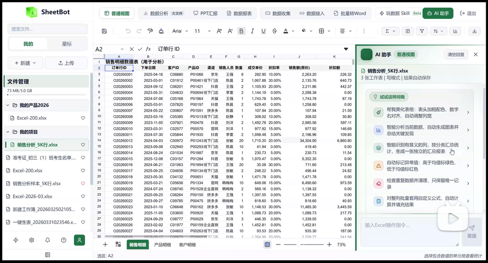

# SheetBot

English | [中文](README_CN.md)

**Enterprise Intelligent Spreadsheet Workbench**

[](https://www.python.org/downloads/)
[](https://fastapi.tiangolo.com/)
[](https://react.dev/)
[](https://www.mysql.com/)
[](LICENSE)

---

## Overview

SheetBot is an **enterprise intelligent spreadsheet workbench**. Built around online Excel, it unifies natural-language control, million-row large-file analytics, smart reports, AI presentations, batch Word generation, online forms, external system connectors, and skill automation—helping teams turn data scattered across spreadsheets, systems, and documents into executable, auditable, and deliverable workflows.

This project is open-sourced and maintained by **Shenzhen BitIntent Technology Co., Ltd. (BitIntent)**. BitIntent focuses on enterprise AI-native product R&D and delivery. Its product portfolio includes SheetBot, GeoOps, and AtlasBot.

- Company website: [https://www.eeebit.com/index.html](https://www.eeebit.com/index.html)
- SheetBot website: [https://sheetbot.eeebit.com/](https://sheetbot.eeebit.com/)

**Ideal for:**

- Private deployment of an enterprise AI spreadsheet and data workbench
- Embedding AI analytics, reporting, and presentation into existing ERP / CRM / OA / HR systems
- Building automated data delivery pipelines for finance, sales, operations, HR, education, healthcare, and more
- Extending enterprise office apps on FastAPI + React + Univer + PPTist

### Platform Demo

The video below shows SheetBot’s core flow—from natural-language spreadsheet control and large-file analytics to report and presentation delivery. For a full online experience, visit the [SheetBot website](https://sheetbot.eeebit.com/).

[](https://www.bilibili.com/video/BV1iyEX6ZEc3/)

### Key Features

- **Enterprise system integration**: API, AI window, and embedded modes to connect ERP, CRM, OA, and more.
- **AI natural-language editing**: Chinese dialogue drives 70+ spreadsheet operations with multi-turn context and SSE real-time execution.
- **Dual-mode Excel engine**: Univer in the browser for small files; server-side DuckDB for million-row analytics on large files.
- **Smart reports**: Auto-extract metrics and insights, generate charts/KPIs, export and share as PDF/PNG.
- **AI presentation PPT**: Auto-plan deck structure from data, edit online, export PPTX in one click.
- **Batch Word generation**: Template + Excel rows to bulk-generate documents with placeholder replacement and ZIP download.
- **Online data collection**: Turn sheet headers into public forms; submissions flow back into the workbook.
- **External connectors**: Shopify, DingTalk, WeCom, databases, Webhooks, etc., with field mapping and scheduled sync.
- **Skill orchestration**: 60+ preset skills, drag-and-drop pipelines, sandbox preview before write-back, team SOP reuse.

---

## System Architecture

SheetBot uses a layered design: **edge/deployment**, **frontend workbench**, **backend business modules**, **AI Harness Engineering guardrails**, and **data & external systems**. The core idea is **Harness Engineering**: the LLM only understands intent and produces constrained structured plans; final spreadsheet operations are generated by plan contracts, a deterministic compiler, and an operation registry—so the same input yields stable, verifiable, rollback-friendly results. Normal Excel mode and large-file mode are strictly isolated in backend modules, data storage, and API transport.


### Layer Overview

| Layer | Description |
|-------|-------------|
| Edge & deployment | Caddy / Nginx for static assets, API reverse proxy, SSE proxy—local or private enterprise deployment |
| Frontend workbench | React app for routing, auth, and business UI; Univer for Excel canvas; PPTist for online PPT editing |
| Backend modules | FastAPI mounts auth, plans, normal-mode agent, large-file, reports, PPT, batch Word, forms, connectors, etc. |
| AI Harness Engineering | Intent vs. deterministic execution: Prompt Expander (metadata, no LLM); Claude Agent with restricted tools (`submit_analysis_plan` only); Plan Contract, Plan Compiler, Operation Registry (70+ ops); sandbox preview/rollback, quota limits, JSON output guards |
| Data & external systems | MySQL for business data; DuckDB for large-file queries; `uploads/` for user files; Claude API, SMTP, third-party integrations |

### Harness Engineering Highlights

- **Restricted tool calls**: Analytics tasks must submit structured plans via `submit_analysis_plan`; the LLM cannot touch data directly.
- **Deterministic compilation**: plan → operations via compiler, not free-form model output—stable layouts for identical inputs.
- **Single source of truth**: Shared operation registry across frontend and backend; 70+ operations with matched parameter contracts.
- **Safety guardrails**: Schema validation, quota limits, JSON repair fallback, sandbox preview, and one-click rollback.

---

## Tech Stack

| Layer | Technologies |
|-------|----------------|
| Frontend | React 19 + Vite 5 + Univer Canvas + PPTist (Vue 3 / veaury) |
| Backend | FastAPI + Uvicorn + SQLAlchemy (async) |
| AI | Claude Agent |
| Database | MySQL 8.0 |
| Large-file engine | DuckDB + pandas + openpyxl |
| Documents | python-pptx / python-docx / ExcelJS |
| Charts & export | ECharts / html2canvas / jsPDF |
| Production | Caddy 2.x (static + API/SSE reverse proxy, optional) |

---

## Third-Party Services & Components

Confirm these dependencies before deployment or customization:

| Type | Service / Component | Purpose | Required |
|------|---------------------|---------|----------|
| AI | Anthropic Claude API or compatible gateway | Spreadsheet assistant, reports, PPT, batch Word | Yes |
| Database | MySQL 8.0+ | Users, plans/quotas, files, forms, connectors, skills | Yes |
| Email | SMTP (enterprise mail, etc.) | Password reset, registration, business inquiries | Optional |
| Connectors | Shopify / DingTalk / WeCom / PostgreSQL / Webhook | External data sync | As needed |
| Frontend build | Node.js 18+ | Install deps, build frontend | Build-time |
| Reverse proxy | Caddy / Nginx | Unified entry, static hosting, API/SSE | Recommended |

Bundled open-source components:

- [Univer](https://github.com/dream-num/univer): Online spreadsheet canvas
- [PPTist](https://github.com/pipipi-pikachu/PPTist): Online PPT editing
- [ECharts](https://echarts.apache.org/): Chart rendering
- [DuckDB](https://duckdb.org/): Server-side OLAP for large files

---

## Installation & Startup

### 1. Clone the repository

```bash
git clone <your-repo-url> sheetbot
cd sheetbot
```

### 2. Configure environment variables

```bash
cp backend/app/.env.example .env
```

Minimum required settings:

```env
PORT=8080
JWT_SECRET_KEY=<openssl rand -hex 32>
ANTHROPIC_API_KEY=<your-claude-api-key>
DB_HOST=localhost
DB_PORT=3306
DB_NAME=sheetbot_db
DB_USER=sheetbot_user
DB_PASS=your-db-password
```

### 3. Initialize the database

```sql
CREATE DATABASE sheetbot_db CHARACTER SET utf8mb4 COLLATE utf8mb4_unicode_ci;
CREATE USER 'sheetbot_user'@'%' IDENTIFIED BY 'your-password';
GRANT ALL ON sheetbot_db.* TO 'sheetbot_user'@'%';
FLUSH PRIVILEGES;
```

```bash
mysql -h localhost -u sheetbot_user -p sheetbot_db < db/schema.sql
```

### 4. Install backend dependencies

```bash
python -m venv .venv

# Windows
.venv\Scripts\activate

# Linux / macOS
source .venv/bin/activate

pip install -r backend/requirements.txt
```

### 5. Build the frontend

```bash
cd frontend
npm install
npm run build
cd ..
```

### 6. Start services

```bash
# Development (hot reload)
PROD_MODE=false python manage.py restart

# Production (requires npm run build first)
python manage.py restart
```

### 7. Access URLs

| URL | Description |
|-----|-------------|
| http://localhost:5173 | Frontend dev server (`PROD_MODE=false`) |
| http://localhost:8080/docs | Backend Swagger API docs |
| http://localhost/workspace | Workbench (production via Caddy) |
| http://localhost/landing.html | Marketing landing page |

For production, use the root [`Caddyfile`](Caddyfile):

```bash
caddy run --config Caddyfile
```

---

## Project Structure

```text
sheetbot/
├── backend/
│   └── app/
│       ├── main.py           # FastAPI entry
│       ├── agent/            # Normal-mode AI agent + analysis compiler
│       ├── large_file/       # Large-file DuckDB pipeline
│       ├── report/           # Smart report engine
│       ├── pptx/             # PPT presentations
│       ├── batch_word/       # Batch Word export
│       ├── collect/          # Online form collection
│       ├── connect/          # External connectors
│       ├── auth/             # JWT authentication
│       ├── plans/            # Plans & quotas (read-only, no online payment)
│       ├── formula/          # Custom formulas
│       └── skill/            # Skill library
├── frontend/
│   ├── src/
│   │   ├── App.jsx           # Main app & mode switching
│   │   ├── univer/           # Univer canvas host
│   │   ├── pptist-vue/       # PPTist subsystem
│   │   ├── components/       # Business UI
│   │   └── utils/            # excelOperations / skillExecutor, etc.
│   └── public/landing.html   # Marketing landing page
├── db/
│   ├── schema.sql            # Database schema (initialization)
│   └── README.md
├── docs-site/                # Docusaurus help center & architecture assets
├── uploads/                  # User-generated files (not in git)
├── manage.py                 # Start/stop script
├── Caddyfile                 # Self-hosted reverse proxy
└── LICENSE                   # Apache-2.0
```

---

## Feature Details

### 1. AI Spreadsheet Assistant (Normal Mode)

Normal mode targets regular Excel files with a **“chat is the operation”** experience. After uploading `.xlsx`, SheetBot renders the full workbook in the browser via Univer Canvas; the AI generates and executes operation plans in real time.

**Highlights:**

- 70+ operations: formulas, cleaning, sort/filter, conditional formatting, data bars, charts, pivot summaries, sizing, styles, and more.
- SSE streams execution progress so users see what the AI is doing—not a black box.
- Multi-turn context: e.g. summarize sales, then “highlight top 3”, “add summary”, “insert chart”.
- Operations run in the frontend spreadsheet engine for instant feedback in a familiar Excel context.

### 2. Large-File Analytics

Large-file mode handles spreadsheets too big for the browser. Above the threshold, data loads into server-side DuckDB; the frontend shows previews, query results, and operation feedback.

**Highlights:**

- Suited for 50MB+, hundreds of thousands to millions of rows—avoids browser OOM and freezes.
- DuckDB for fast aggregate/filter/group/sort; openpyxl preserves Excel styling and export.
- Natural-language queries—no SQL required from business users.
- Isolated from normal mode in modules, APIs, and storage for maintainability.

### 3. Smart Reports

Reports organize the analytics process into readable, shareable, auditable deliverables—not just screenshots or chart exports.

**Highlights:**

- Auto-detect metrics, dimensions, trends, anomalies, rankings, and ratios; KPI cards and multi-chart layouts.
- Business-context expert commentary with risks and next-step suggestions.
- Tasks, snapshot cache, share links, PDF/PNG export for team reporting and archives.
- Chain from normal or large-file analysis: **analyze → insight → deliver**.

### 4. AI Presentation PPT

Generates editable decks from spreadsheet data for monthly reviews, business retrospectives, project summaries, and more.

**Highlights:**

- AI plans narrative structure before page content—not charts without story.
- Built-in PPTist for post-generation editing of text, charts, layout, and theme.
- Two-phase injection of KPIs, charts, and spoken-ready conclusions.
- PPTX export for executive, sales, and finance deliverables.

### 5. Batch Word Export

One data table → many standardized documents: certificates, notices, contracts, proofs, quotes, etc.

**Highlights:**

- AI-assisted placeholder detection and Excel field mapping on Word templates.
- Text, date, number, and image replacement—fewer copy-paste errors.
- One document per row, custom naming, ZIP download.
- Ideal for education, HR, sales, and admin teams with high-volume document output.

### 6. Online Data Collection

Turn sheet column headers into public fillable forms—no more manual merge of many submissions.

**Highlights:**

- Quick form fields from the current sheet: text, number, options, dates, etc.
- Public links; external users can submit without login.
- Submissions flow back into the workbook in real time.
- Registrations, surveys, store reporting, lead capture, and more.

### 7. External Connectors

Bring enterprise system data into SheetBot so AI analysis is not limited to manual uploads.

**Highlights:**

- Shopify, DingTalk, WeCom, MySQL, PostgreSQL, Webhook, custom APIs, and more.
- Field mapping, sync jobs, and connection health for normalized workbench data.
- Scheduled sync and inbound Webhooks for orders, customers, staff, stores, ops data.
- Synced data feeds AI analysis, reports, PPT, and skill pipelines.

### 8. Skill Orchestration

Package common data steps into visual workflows and team SOPs.

**Highlights:**

- 60+ preset skills: formatting, cleaning, stats, analysis, visualization.
- Drag-and-drop pipelines for business scenarios.
- Sandbox preview before write-back to reduce risk.
- Variables and team reuse—turn individual know-how into shared practice.

---

## Dual-Mode Architecture (Important)

| Dimension | Normal mode | Large-file mode |
|-----------|-------------|-----------------|
| Use case | Small Excel (<50MB) | Large Excel (>50MB) |
| Data storage | Browser memory (Univer) | Server DuckDB |
| Backend module | `agent/` | `large_file/` |
| Transport | SSE | HTTP REST API |
| API prefix | `/api/excel/*`, `/sse/*` | `/api/large-file/*` |

Normal mode optimizes live editing; large-file mode optimizes server-side compute. Modules, entry points, API prefixes, and storage stay separate so small-file UX does not entangle with large-file pipelines.

---

## Database Schema (Summary)

| Group | Main tables |
|-------|-------------|
| Auth | `users` `refresh_tokens` `password_reset_tokens` |
| Plans | `subscription_plans` `user_subscriptions` `usage_records` |
| Business | `custom_formulas` `skills` `forms` `connectors` `sync_jobs` |
| Reports | `report_cache` `shared_reports` `report_tasks` |
| Config | `user_preferences` `platform_settings` `system_announcements` |

Full DDL: [`db/schema.sql`](db/schema.sql).

---

## API Endpoints (Partial)

| Endpoint | Description |
|----------|-------------|
| `POST /api/auth/register` | User registration |
| `POST /api/auth/login` | Login and obtain tokens |
| `POST /api/excel/command` | Send AI command (normal mode) |
| `GET /sse/{session_id}` | SSE event stream |
| `POST /api/large-file/upload` | Large-file upload |
| `GET /api/large-file/preview/{id}` | Large-file preview |
| `POST /api/report/generate` | Generate smart report |
| `POST /api/pptx/generate` | Generate presentation |
| `POST /api/batch-word/upload-template` | Upload batch Word template |
| `GET /api/public/plans` | Public plan pricing (landing) |
| `GET /api/plans/my` | Current user plan (auth required) |

After starting the backend, open **http://localhost:8080/docs** for full OpenAPI documentation.

---

## Environment Variables

| Variable | Required | Description |
|----------|----------|-------------|
| `JWT_SECRET_KEY` | Yes | `openssl rand -hex 32` |
| `ANTHROPIC_API_KEY` | Yes | Claude API key |
| `DB_HOST` / `DB_PORT` / `DB_NAME` / `DB_USER` / `DB_PASS` | Yes | MySQL connection |
| `SHEETBOT_PUBLIC_BASE_URL` | No | Public base URL for password-reset links |
| `SMTP_*` | No | Registration / password-reset email |
| `ANTHROPIC_BASE_URL` | No | Custom API gateway URL |

---

## UGC Storage

User uploads and generated files live under project root `uploads/`, partitioned by type and date:

```text
uploads/
├── excel_files/YYYY-MM-DD/
├── pptx_files/YYYY-MM-DD/
├── report_files/YYYY-MM-DD/
├── word_files/YYYY-MM-DD/
└── demo/
```

Do **not** store user data under `backend/uploads/`.

---

## Development Guide

### Backend

- Python 3.11+, PEP 8, type hints and clear logging recommended.
- Route all AI calls through Claude Agent—do not bypass the unified entry.
- Keep normal and large-file modes isolated; verify API prefix, storage, and execution path before changes.

### Frontend

- React 19 + Vite 5; PPTist is Vue 3 via veaury.
- Normal-mode spreadsheet ops run in the frontend engine—sync contracts when adding operations.
- Production build: `cd frontend && npm run build`.

### Testing

```bash
# Frontend unit tests (Vitest)
cd frontend && npm test

# Frontend E2E (Playwright; start services first)
cd frontend && npm run e2e:smoke
```

### Contributing

1. Fork and work on a feature branch.
2. Preserve normal vs. large-file mode isolation.
3. Include change notes, screenshots, or test results in PRs.

---

## Changelog

### v1.0.0 (Open Source)

- Initial open-source release of SheetBot (enterprise intelligent spreadsheet workbench).
- AI natural-language spreadsheets, large-file analytics, reports, PPT, batch Word, forms, connectors, skills.
- Removed admin panel, standalone marketing site, WeChat Pay, and Alembic migration history.
- Database initialization via `db/schema.sql` only.

---

## Documentation Index

| Document | Purpose |
|----------|---------|
| [README.md](README.md) | English: overview, build, and customization |
| [README_CN.md](README_CN.md) | 中文: overview, build, and customization |
| [db/README.md](db/README.md) | Database initialization |
| [backend/app/.env.example](backend/app/.env.example) | Environment variable template |
| [docs-site/docs/00-目录.md](docs-site/docs/00-目录.md) | User guide index (Chinese) |

---

## Company & Product

SheetBot is an **enterprise intelligent spreadsheet workbench** from **Shenzhen BitIntent Technology Co., Ltd. (BitIntent)**. BitIntent delivers an AI-native product stack spanning data execution, brand growth, and knowledge engineering.

- Company website: [https://www.eeebit.com/index.html](https://www.eeebit.com/index.html)
- SheetBot product site: [https://sheetbot.eeebit.com/](https://sheetbot.eeebit.com/)

| Business cooperation | SheetBot community |
| :---: | :---: |
|  |  |
| Enterprise consulting, private deployment, partnerships, and custom solutions. | Open-source deployment, development, feedback, and user discussion. |

---

## Contributing & Feedback

Issues, pull requests, and usage feedback are welcome. For commercial editions, private deployment, enterprise integration, or pilot programs, contact us via the company or SheetBot website.

---

## License

This project is licensed under the [Apache License 2.0](LICENSE).
